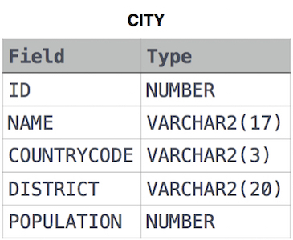

# Revising the Select Query I

**Difficulty:** Easy
**Category:** sql
**Language:** db2
**Link:** https://www.hackerrank.com/challenges/revising-the-select-query/problem

---

Query all columns for all American cities in the CITY table with populations larger than 100000. The CountryCode for America is USA.

The CITY table is described as follows:

